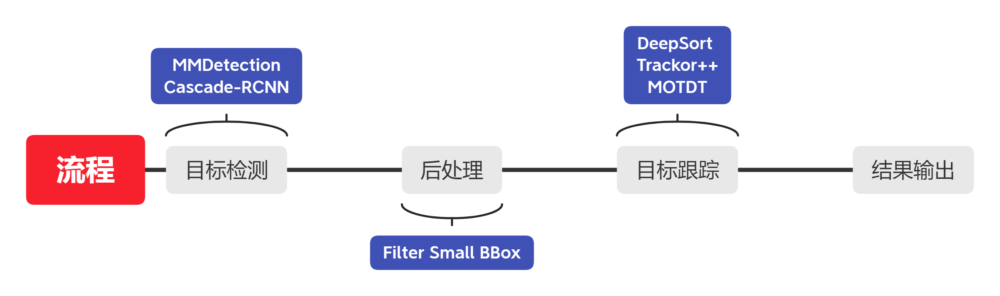
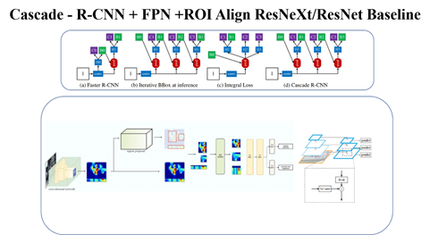
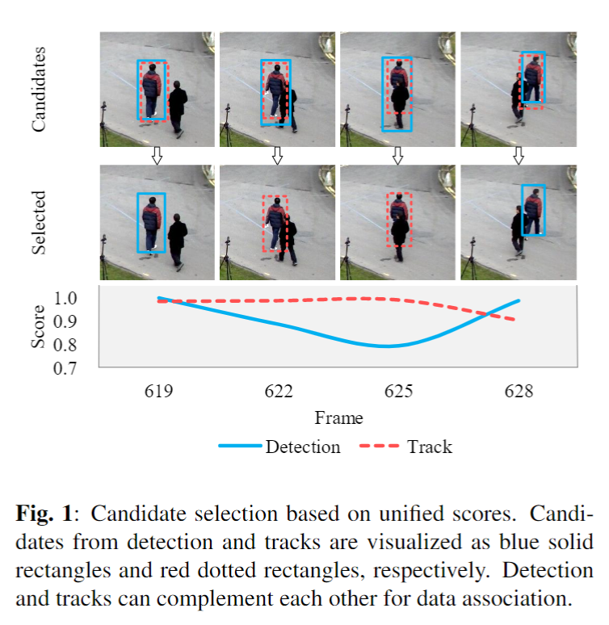
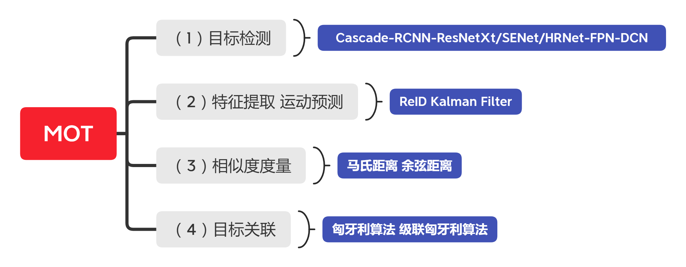

# Cascade-RCNN-Tracking

## 整体流程

- 目标检测模型采用Cascade-RCNN+ResXt101+Focalloss+GIOU+DCN
- 行人数据集采用coco human、crowdhuman、MOT16-17
- 目标跟踪采用DeepSort、MOTDT、Trackor++
- 特征提取采用Mutiple Granularity Network



## Cascade-RCNN

目前来说精度最高的目标检测框架，经常出没在各类比赛中。在检测性能的优化上使用了Focalloss、GIOU，Warmup LR、多尺度训练，模型推理使用TTA，数据集采用Crowdhuman，部分训练的Log在work_dir文件夹下，以供参考，最终效果在80+以上。

对于MMDetection这框架，1.0版本是不支持GIOU的，最新2.0是支持的，所以GIOU这部分程序我自己加上了，这边底层比较好改，RPN层使用FocalLoss这样可以缓解由于目标占比较少导致生成的Anchor正负样本比例失衡，双卡1080Ti大概训练了3天。

<div align=center></div>

## DeepSort

创新性地提出融合卡尔曼滤波与匈牙利匹配算法进行目标跟踪。

### 工作流程

1.检测器得到bbox

2.卡尔曼滤波**预测**

3.使用匈牙利算法将**预测后的tracks**和**当前帧中的detecions进行匹配**（级联匹配和IOU匹配）

4.卡尔曼滤波**更新**

* Frame 0：检测器检测到了3个detections，当前没有任何tracks，将这3个detections初始化为tracks                                                                                          
* Frame 1：检测器又检测到了3个detections，对于Frame 0中的tracks，先进行预测得到新的tracks，然后使用匈牙利算法将新的tracks与detections进行匹配，得到(track, detection)匹配对，最后用每对中的detection更新对应的track（因此DeepSort是非常依赖目标检测产生的结果的）

### 算法参数

| 参数             | 作用                                                         |
| ---------------- | ------------------------------------------------------------ |
| max_dist         | 最近邻距离度量，马氏距离与余弦距离，用在级联匹配的地方，如果大于此距离，就直接忽略，不进行跟踪 |
| min_confidences  | 检测阈值，忽略所有低于这个值的目标                           |
| nms_max_overlap  | 最大检测重叠，默认为1.0，既不做筛选，若降低该值，则会筛选IOU重叠大于该值的框 |
| max_iou_distance | IOU距离，当IOU小于一定数值时，不认为是同一个目标，注意结果是1-Iou，max_iou_distance所以越大越好 |
| max_age          | 跟踪目标存活期限，代表一个Track存活期限，默认参数是70帧，对于运动速度快的需要减小该值。级联匹配中的循环次数 |
| n_init           | 在类Track中用于判断当前目标状态是否为confirmed，默认参数是3，即当目标确认三次则分配ID，并且此参数用于限制delete的阈值 |
| nn_budget        | 特征列表的长度，每个ID都有一个特征列表，此特征为ReID提取到的特征，如果超过，删除旧的 |

### 匈牙利算法（Hungarian Algorithm）

匈牙利算法用于解决二分图的**最大匹配**问题

算法步骤（假设矩阵为NxN方阵）：

1. 对于矩阵的每一行，减去其中最小的元素
2. 对于矩阵的每一列，减去其中最小的元素
3. 用最少的水平线或垂直线覆盖矩阵中所有的0
4. 如果线的数量等于N，则找到了最优分配，算法结束，否则进入步骤5
5. 找到没有被任何线覆盖的最小元素，每个**没被线覆盖的行**减去这个元素，每个**被线覆盖的列**加上这个元素，返回步骤3

在DeepSORT中，匈牙利算法用来将前一帧中的**跟踪框tracks**与当前帧中的**检测框detections**进行关联，通过**外观信息（appearance information）**和**马氏距离（Mahalanobis distance）**或者余弦距离，或者**IOU**来计算代价矩阵。

### 卡尔曼滤波（Kalman Filter）

多用于多传感器信息融合，比如有两个加速度计A、B，通过卡尔曼滤波可以预测出下一时刻最佳组合（0.3A+0.7B）。本质上是利用当前状态的观测值去预测下一个状态的预测值。

卡尔曼滤波分为两个阶段：(1) **预测**track在下一时刻的位置，(2) 基于detection来**更新**预测的位置。

### 特征提取（ReID）

Mutiple Granularity Network 多重粒度网络

MGN是一个多分支的深度网络：**一个全局特征表示**的分支和**两个局部特征表示**的分支。


不同的N表示不同的粒度，N越大粒度越细。中间的分支N=2，可以理解为将行人分为上半身和下半身；下面的分支N=3，可以理解为将行人分为上，中，下三个部分。

ReID的优化建议参考罗浩老师的Strong ReID Baseline

## MOTDT

其**核心思想**是同时从Object detection和object tracking里同时生成object candidates (bbox)，设计一种**评分机制**以选择最终的Candidates（如下图）。这里的intuition是detection和tracking是相辅相成的，比如detection里的high confidence结果可以防止tracking drifts，而tracking可以降低detection带来的偶然的不准确性。

MOTDT相比较DeepSort在预测同时考虑了目标检测产生的BBox和卡尔曼滤波预测的BBox，并且评分机制是考虑了BBox区域的分类结果和跟踪是否断开来评分。

<div align=center></div>

## 目标跟踪

### 模块

* Data Association
* Motion
* Appearance

### 评价指标

| 参数                                     | 介绍                                                         |
| :--------------------------------------- | :----------------------------------------------------------- |
| MOTA(Multiple Object Tracking Accuracy)  | 主要考虑的是跟踪中所有对象匹配错误，主要是FP,FN,IDs          |
| IDF1                                     | 正确识别的检测与真实数和计算检测的平均数之比                 |
| MOTP(Multiple Object Tracking Precision) | 主要量化检测器的定位精度，几乎不包含与跟踪器实际性能相关的信息 |
| MT(Mostly Tracked)                       | 满足Ground Truth至少在80%的时间内都匹配成功的track，在所有追踪目标中所占的比例。注意这里的MT和ML与当前track的ID是否发生变化无关，只要Ground Truth与目标匹配上即可 |
| ML (Mostly Lost)                         | 满足Ground Truth在小于20%的时间内匹配成功的track，在所有追踪目标中所占的比例。 |
| FP (False Positive)                      | 当前帧预测的track和detection没有匹配上，将错误预测的track点称为FP |
| FN (False Negative)                      | 当前帧预测的track和detection没有匹配上，将未被匹配的ground truth点称为FN（也可以称为Miss） |
| Recall                                   | 正确检测与总GT数之比                                         |
| Precision                                | Ratio of TP / (TP+FP)                                        |
| FAF                                      | 每帧的平均错误数                                             |
| ID Sw.                                   | Ground Truth所分配的ID发生变化的次数                         |
| Frag                                     | 一个轨迹在跟踪过程中断的总次数。                             |
| Hz                                       | 处理速度(以帧/秒计算，不包括检测器)，频率由作者提供，而不是由MOTChallenge正式评估。 |

## 项目结构

```
├─configs
│   └─MyDet    模型配置文件
├─deep_sort    deepsort代码
├─MOTDT        MOTDT代码
├─tracktor     Trackor++代码，测试显示效果并不好，增加迭代次数，直接显存爆满
├─MGN          Mutiple Granularity Network用于替换deepsort的ReID
├─models       MMDetection官方训练的coco模型
├─mmdet        底层，此处部分与官方master分支不一致,目前cascade不支持在bbox使用IOU，GIOU，修改参看
│			   models\losses\iou_loss.py
│		       models\bbox_heads\bbox_head.py
│			   models\detectors\cascade_rcnn.py		       
├─pre_dataset_coco
│  │  anchor_solver.py     计算anchor的最佳参数
│  │  refacter_pretrain.py 对官方模型进行修改，修改FC层
│  │  coco2person.py 将coco中含有人的数据提取出来，包含mask，实验测试，有mask的框架比无mask精度高
│  │  coco2voc.py         coco转voc
│  │  crowdhuman2coco.py  crowdhuman转coco，用coco的预训练模型在crowdhuman训练，效果最好
│  │  final_to_coco.py    整合所有数据集
│  │  make_mot19.py
│  │  mot15_to_coco.py
│  │  mot16_to_coco.py
│  │  mot17_to_coco.py
│  │  mot19_to_coco.py
│  │  PRW_to_coco.py
│  └─ voc2coco.py
└─work_dir  部分数据集的训练模型，log，包含crowdhuman，MOT16-17，均采用cascade rcnn
│  │  coco_mot16_17_res_50_focalloss_giou_cascade_rcnn_dconv_c3-c5_fpn_1x
│  └─ coco_crowdhuman_resxt_101_focalloss_giou_cascade_rcnn_dconv_c3-c5_fpn_1x
│  my_deep_sort_mgn.py  结合cascade rcnn + deepsort + MGN
│  my_MOTDT.py          结合cascade rcnn + MOTDT
│  my_trackor.py        结合cascade rcnn + Trackor++
│  requirements.txt
│  setup.py
│  test_all.sh          模型测试脚本，用于挂机
```

## 环境配置

Ubuntu 16.04.4 LTS 单卡1080Ti CUDA Version 10.0.130

首先安装[MMdetection](https://mmdetection.readthedocs.io/en/latest/install.html)，下载代码并执行conda env create -f environment.yml即可完成环境安装，并执行conda activate env进入环境。

## 总结

目前来说对跟踪效果影响最大的是目标检测的性能，相对于公开的检测，私有检测提升幅度巨大。

对于跟踪模块，目前来说还有更好的解决方案，比如使用MOTDT，此算法在DeepSort的基础上加入了轨迹评分的机制，目前像FairMOT、JDE使用的跟踪模块都是MOTDT，从精度和速度上此算法表现都是不错的。



## 参考

[MOTChallenge](https://motchallenge.net/)

[行人检测数据集汇总（持续更新） - 知乎](https://zhuanlan.zhihu.com/p/31836357)

[Pedestrian Detection - Papers With Code](https://paperswithcode.com/task/pedestrian-detection)

[Multi-Object Tracking - Papers With Code](https://paperswithcode.com/task/multi-object-tracking)

CVPR 2020

* [CVPR 2020 Code 目标跟踪](https://github.com/amusi/CVPR2020-Code#Object-Tracking)
* [CVPR 2020 论文大盘点—行人检测与重识别篇](https://mp.weixin.qq.com/s/0NujdJmt6IzuCPP6N8Fa_A)
* [CVPR 2020 论文大盘点—目标跟踪篇](https://mp.weixin.qq.com/s?__biz=MzIwMTE1NjQxMQ==&mid=2247516614&idx=2&sn=a7deb77f6bdc97603de8b8fdde13d793&chksm=96f0f392a1877a841ef0fa4ca6d9d770fa0258ab4f495a409d9d75e4c462b8414b128edb2fee&scene=21#wechat_redirect)

Public Tracking

* [DeepMOT 端到端的数据关联](https://gitlab.inria.fr/yixu/deepmot)
* [MPN Tracker 端到端的数据关联](https://github.com/dvl-tum/mot_neural_solver)
* [LibMOT Public-目标跟踪整合库](
  https://github.com/nightmaredimple/libmot)

Object Detection

* [Crowdhuman人体检测比赛第一名经验总结 - 知乎](https://zhuanlan.zhihu.com/p/68677880)

  [【智源-旷视科技】2019冠军团队经验分享 | 2020 CrowdHuman 人体检测大赛经验分享_哔哩哔哩 (゜-゜)つロ 干杯~-bilibili](https://www.bilibili.com/video/BV1g5411W7Bo?from=search&seid=17939842903110119715) [PPT链接](https://pan.baidu.com/s/14tA77RTS9yuyxEmBJJF_DA) 提取码：ah3m

* [Detection in Crowded Scenes: One Proposal, Multiple Predictions]()

Other Implement

* [ZET MOT RANK2](https://github.com/TimeChi/ZXMOT)
* [ZET MOT B-Data Top-1](https://github.com/muzishen/deepsort)
* [**HorizonMOT**](https://arxiv.org/abs/2006.15506)
